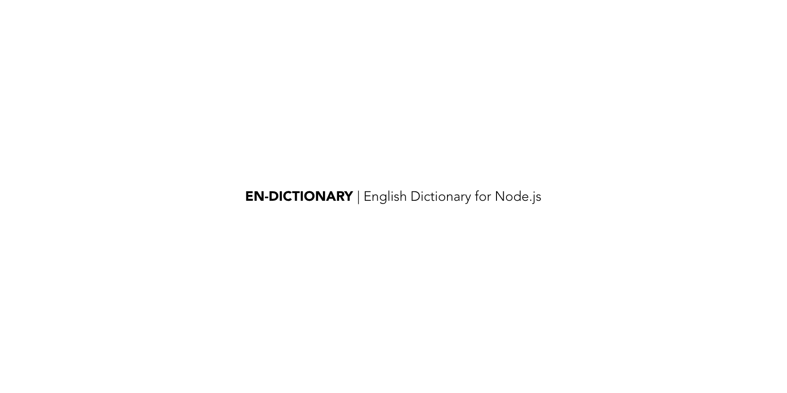

En-Dictonary is a node.js module which makes works and their relations available as a package.

## About

This packages uses the [En-Wordnet](https://github.com/open-language/en-wordnet) package to make the words, their meanings and relationships available to your node.js package. It also adds helper functions for other ways to access the information.

## Quick Start

You can install the package via `npm` or `yarn`

```
yarn add en-dictionary
```

Once it has been added, you need to initialize the dictionary, like so
```js
const enDictionary = require('./index')

const start = async () => {
    const dict = await enDictionary.init()
    const result = dict.query('preposterous')
    console.log(JSON.stringify(result, null, 2))
}

start()
```
There are some more [examples here](https://github.com/open-language/en-dictionary/blob/master/index.test.js).

The dictionary can take about 2000ms to load the data in memory, it doesn't use an external database/redis yet (nor is that planned, since most queries are fast enough, and the underlying data doesn't changes probably once a year)

### Query words

You can query for a single word with this syntax. If you want to use multiple words, replace the ` ` with `_`.
```js
let result = dict.query('preposterous')
result = dict.query('word_for_word')
```

Here's a sample outlet that you can expect for the queries above

```json
{
  "word": "preposterous",
  "pos": "adjective",
  "synsetOffsets": [
    2570643
  ],
  "synsets": {
    "2570643": {
      "offset": 2570643,
      "pos": "ajective satellite",
      "words": [
        "absurd",
        "cockeyed",
        "derisory",
        "idiotic",
        "laughable",
        "ludicrous",
        "nonsensical",
        "preposterous",
        "ridiculous"
      ],
      "glossary": [
        "incongruous",
        "inviting ridicule",
        "\"the absurd excuse that the dog ate his homework\"",
        "\"that's a cockeyed idea\"",
        "\"ask a nonsensical question and get a nonsensical answer\"",
        "\"a contribution so small as to be laughable\"",
        "\"it is ludicrous to call a cottage a mansion\"",
        "\"a preposterous attempt to turn back the pages of history\"",
        "\"her conceited assumption of universal interest in her rather dull children was ridiculous\""
      ],
      "linked": {
        "852922": {
          "why": "Derivationally related form",
          "offset": 852922,
          "pos": "verb",
          "words": [
            "deride"
          ],
          "glossary": [
            "treat or speak of with contempt",
            "\"He derided his student's attempt to solve the biggest problem in mathematics\""
          ]
        },
        "2570282": {
          "why": "Similar to",
          "offset": 2570282,
          "pos": "adjective",
          "words": [
            "foolish"
          ],
          "glossary": [
            "devoid of good sense or judgment",
            "\"foolish remarks\"",
            "\"a foolish decision\""
          ]
        },
        "4891683": {
          "why": "Derivationally related form",
          "offset": 4891683,
          "pos": "noun",
          "words": [
            "absurdity",
            "fatuity",
            "fatuousness",
            "silliness"
          ],
          "glossary": [
            "a ludicrous folly",
            "\"the crowd laughed at the absurdity of the clown's behavior\""
          ]
        },
        "6607809": {
          "why": "Derivationally related form",
          "offset": 6607809,
          "pos": "noun",
          "words": [
            "absurdity",
            "absurdness",
            "ridiculousness"
          ],
          "glossary": [
            "a message whose content is at variance with reason"
          ]
        }
      }
    }
  }
}
```

```json
{
  "word": "word_for_word",
  "pos": "adverb",
  "synsetOffsets": [
    257864
  ],
  "synsets": {
    "257864": {
      "offset": 257864,
      "pos": "adverb",
      "words": [
        "verbatim",
        "word_for_word"
      ],
      "glossary": [
        "using exactly the same words",
        "\"he repeated her remarks verbatim\""
      ],
      "linked": {}
    }
  }
}
```

### Find words which start with, end with or include a certain set of words

You can find words which start or end with a specific set of words, you can do this

```js
let result = dict.startsWith('prestig')
result = dict.endsWith('sterous')
result = dict.includes('grating')
```

Here's what you would get on running the functions above

```json
[
  "prestigious",
  "prestige",
  "prestigiousness"
]
```

```json
[
  "blusterous",
  "boisterous",
  "preposterous"
]
```

```json
[
  "gratingly",
  "denigrating",
  "grating",
  "diffraction_grating",
  "integrating"
]
```

### Find words which can be created with a given set of words

This is useful when you're playing scrabble or a similar game. You can define the list of characters that you have available and the minimum length of the words that you need

```js
let result = dict.withCharsIn('toaddndyrnrtssknwfsaregte', 10)
```

You can expect the following output if you run the command above

```json
[
  "transgressor",
  "grandstander",
  "nonattender",
  "transferase",
  "strangeness",
  "anterograde",
  "forwardness",
  "nonstandard",
  "transgender",
  "rottenness",
  "transgress",
  "retrograde",
  "greensward",
  "narrowness",
  "afterwards",
  "nonstarter",
  "orangeness",
  "ornateness",
  "retreatant",
  "retrogress",
  "setterwort",
  "stewardess",
  "grandstand",
  "aftertaste",
  "transferer",
  "transferor",
  "frontwards",
  "wantonness",
  "waterfront"
]
```

### Find words which have all of the words of a given word

This is sort of the opposite of what we did above
```js
let result = dict.withEachCharIn('princetonuniversity')
```

You can expect the following output if you run the command above
```json
[
  "minnesota_multiphasic_personality_inventory",
  "princeton_university",
  "royal_society_of_london_for_improving_natural_knowledge",
  "united_society_of_believers_in_christ's_second_appearing"
]
```

## Is this credible?

We currently rely on Version 3.0 of [Princeton University's Wordnet](https://wordnet.princeton.edu/), the data for which is available as a separate package. We will be adding more with time.

## Credits

- [TJ Holowaychuk](https://github.com/tj) for showing us how to use black and white beautifully to create the image on the top of the readme. Inspiration from [apex/up](https://github.com/apex/up)
- [Princeton Univerysity's Wordnet](https://wordnet.princeton.edu/) for bringing so much sanity in the world